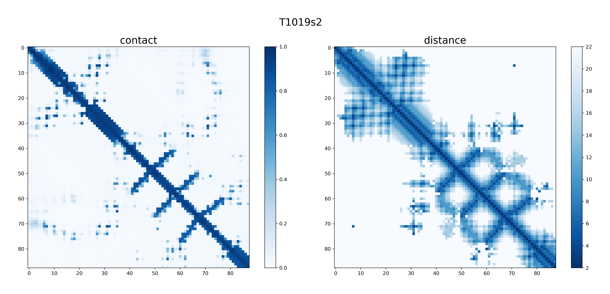

# AlphaFold - PyTorch

This project provides an implementation of the DeepMind's AlphaFold based on PyTorch for research, also includes the converted model weights and inputs. Note that this code can also works well on the original `.ckpt` format model weights and `.tfrec` format inputs.

The original DeepMind's implementation is based on TensorFlow, related publication paper is *Senior, A.W., Evans, R., Jumper, J. et al. Improved protein structure prediction using potentials from deep learning. Nature 577, 706–710 (2020)*. [[code]](https://github.com/deepmind/deepmind-research/tree/master/alphafold_casp13) [[paper]](https://rdcu.be/b0mtx)

## Comparison



I calculated the differences of the final output `distogram probs` between the PyTorch version and original TensorFlow version. The `distogram probs` is full set of distance distribution predictions constructed by combining such predictions that covers the entire distance map, which size is `LxLx64`. Take target `T1019s2` for example, the error of distogram probs (`88x88x64`) between these two results is `0.467` per channel. The picture above is the result of `T1019s2`.

Despite the speed is around 7 times slower than the TensorFlow version, I still recommend this project for you because I refactored the entire code and provided a simplest way for you to understand AlphaFold. In addition, contrast to TensorFlow, PyTorch is imperative and you can simply throw in a pdb breakpoint anywhere into your model.

## Usage

### Dependencies

*   Python 3.6+
*	PyTorch 1.3+
*   *TensorFlow 2.0+ (This is optional if you want to load original `.ckpt` format model weights and `.tfrec` format inputs)*

### Run example prediction

You can use the `alphafold.sh` script to run the entire Distogram prediction system.
```bash
./alphafold.sh
```
You can simply modify the keywords such as `TARGET`, `TARGET_FILE` in this file to run prediction for other targets.

### Detailed script usage

```bash
> python alphafold.py -h
usage: alphafold.py [-h] -i INPUT [-o OUT] [-m MODEL] [-r REPLICA]
                    [-t {D,B,T}] [-e]

optional arguments:
  -h, --help            show this help message and exit
  -i INPUT, --input INPUT
                        target protein, support both .pkl or .tfrec format
  -o OUT, --out OUT     output dir
  -m MODEL, --model MODEL
                        model dir
  -r REPLICA, --replica REPLICA
                        model replica
  -t {D,B,T}, --type {D,B,T}
                        model type: D - Distogram, B - Background, T - Torsion
  -e, --ensemble        ensembling all replica outputs
```
For example:
```bash
python alphafold.py -i test_data/T1019s2.pkl -o T1019s2_out -t D -r 0
```
This uses the replica `0` of `Distogram` models to predict the distogram probs of the input data.

It also supports tensorflow data input and model:
```bash
python alphafold.py -i test_data/T1019s2.tfrec -o T1019s2_out -m tf_model_path/
```


## Data

### Model weights

All converted model weights data can be downloaded from http://bit.ly/alphafold-model. The weights data are in a zip file which has about 210 MB, in the `model` folder which contains:
-  A directory `873731`. This contains the weights for the distogram model.
-  A directory `916425`. This contains the weights for the background distogram model.
-  A directory `941521`. This contains the weights for the torsion model.

Each directory with model weights contains a number of different model configurations. Each model has a config file and associated weights. There is only one torsion model. Each model directory also contains a stats file that is used for feature normalization specific to that model.

The original TensorFlow model checkpoints can be downloaded from http://bit.ly/alphafold-casp13-weights.

### Input data

For now the input data is `.pkl`, `.npy` or `.tfrec` format file which contains required features. The details of those feature generation can be found in the README of DeepMind's AlphaFold project.

For convenience, I provided a shell script `feature.sh` to generate those required features data from given target sequence (`.seq` file, fasta format). Before run this script, there are a few steps you need to start with:

1. Setup PSI-BLAST from [NCBI BLAST](https://blast.ncbi.nlm.nih.gov/Blast.cgi?CMD=Web&PAGE_TYPE=BlastDocs&DOC_TYPE=Download).
2. Setup HHBlits from [HH-suite3](https://github.com/soedinglab/hh-suite).
    ```bash
    # Installation HH-suite
    git clone https://github.com/soedinglab/hh-suite.git
    mkdir -p hh-suite/build && cd hh-suite/build
    cmake -DCMAKE_INSTALL_PREFIX=. ..
    make -j 4 && make install
    export PATH="$(pwd)/bin:$(pwd)/scripts:$PATH"
    # Download Databases
    cd ..; mkdir databases; cd databases
    wget http://wwwuser.gwdg.de/~compbiol/uniclust/2018_08/uniclust30_2018_08_hhsuite.tar.gz
    tar xzvf uniclust30_2018_08_hhsuite.tar.gz
    ```
3. Setup [plmDCA](https://github.com/magnusekeberg/plmDCA), which need `Matlab` or `Octave` to run this code. Here I provided a modified `plmDCA.m` file for Octave which can save the intermediate data that alphafold needs, but I haven't test it in matlab.
    ```bash
    git clone https://github.com/magnusekeberg/plmDCA.git
    mv plmDCA/plmDCA_asymmetric_v2 plmDCA/plmDCA
    cp plmDCA.m plmDCA/plmDCA_asymmetric_v2/
    # mex .c file, if you use matlab you need do this in matlab console
    cd plmDCA/plmDCA_asymmetric_v2/functions/; for i in *.c; do octave --eval "mex $i";done
    cd ../3rd_party_code/minFunc/; for i in *.c; do octave --eval "mex $i"; done
    ```
4. In `feature.sh` set the following:
    - `TARGET` to the name of the target.
    - `TARGET_DIR` to the path to the directory with the target input data.
    - `TARGET_SEQ` to the path of the target input seq file.
    - `PLMDCA_DIR` to the path of plmDCA folder.

The example target `T1019s2` input data, output results by two version AlphaFold for comparison and its generated features you get download from http://bit.ly/alphafold-T1019s2, which has about 210 MB.

The dataset to reproduce AlphaFold's CASP13 results can be downloaded from http://bit.ly/alphafold-casp13-data, which has about 43.5 GB.

Note that, `profile_with_prior` and `profile_with_prior_without_gaps` two features I can't figure it out, so it just be set to all zeros for now. Please let me know if you have any idea.
